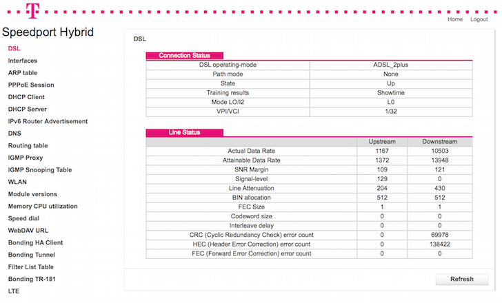

l33tport
======

#### Downloads JSON status data from Telekom Speedport Hybrid

You own a Telekom Speedport Router? The web-interface sucks? It forces you to login every fucking time? You want to draw fancy rrdtool-graphs from raw data?

This script helps you to access the status information that is available in the "hidden" [Engineer-Menu](http://speedport.ip/engineer/html/dsl.html?lang=en), which is only available after you perform a login on the bloated web interface.



Prerequisites
==========
l33tport was written using node.js, so you need to have a working node installation. For the crypto-foo the [Stanford Javascript Crypto Library](https://github.com/bitwiseshiftleft/sjclsjcl.js) is used. A minified copy is part of this repository (```sjcl.js```).

Usage
=====

Adjust the address (Usually ```speedport.ip``` / ```192.168.2.1```) and the password in the head of the script.

You may use one ore more of the following options as arguments:

* **dsl**              DSL connection status and line information
* **interfaces**       Network interfaces
* **arp**              ARP table
* **session**          PPPoE Session
* **dhcp_client**      DHCP client
* **dhcp_server**      DHCP server, includes DHCP leases 
* **ipv6**             IPv6 Router Advertisement
* **dns**              DNS server and cache information
* **routing**          Routing table
* **igmp_proxy**       IGMP Proxy
* **igmp_snooping**    IGMP Snooping Table
* **wlan**             WLAN status and information
* **module**           Software version information
* **memory**           Memory and CPU utilization
* **speed**            Speed dial
* **webdav**           WebDAV URL
* **bonding_client**   Bonding HA client
* **bonding_tunnel**   Bonding tunnel
* **filterlist**       Filter list table
* **bonding_tr181**    Bonding TR-181
* **lteinfo**          LTE information
* **Status**           Systeminformation (no login needed)

 Usage
=====

To get DSL line information and memory utilisation of the router, call

 ```./l33tport.js dsl memory```

The result will look like this:git 
 
```JSON

{
	'Connection':
	{
		'dsl_operaing_mode':'ADSL_2plus',
		'path_mode'		 :'None',
		'state'			 :'Up',
		'training_results'	 :'Showtime',
		'mode_lo'			 :'L0',
		'vpi_vci'			 :'1/32'
	},
	'Line':
	{
		'uactual'		:'1167',
		'dactual'		:'10503',
		'uattainable'	:'1368',
		'dattainable'	:'13972',
		'uSNR'		:'109',
		'dSNR'		:'121',
		'uSignal'		:'129',
		'dSignal'		:'0',
		'uLine'		:'204',
		'dLine'		:'430',
		'uBIN'		:'512',
		'dBIN'		:'512',
		'uFEC_size'	:'1',
		'dFEC_size'	:'1',
		'uCodeword'	:'0',
		'dCodeword'	:'0',
		'uInterleave'	:'0',
		'dInterleave'	:'0',
		'uCRC'		:'0',
		'dCRC'		:'69979',
		'uHEC'		:'0',
		'dHEC'		:'138428',
		'uFEC'		:'0',
		'dFEC'		:'0'
	}
}

 
{
    'amm'             :'253092 KB',
    'used_free_main'  :'48% vs 52%',
    'afm'             :'262144 KB',
    'used_free_flash' :'61% vs 39%',
    'cpu_load'        :'5%',
    'adcm'            :'512 KB',
    'used_free_dns'   :'4.63% vs 95.37%',
    'nodce'           :'354'
}

```